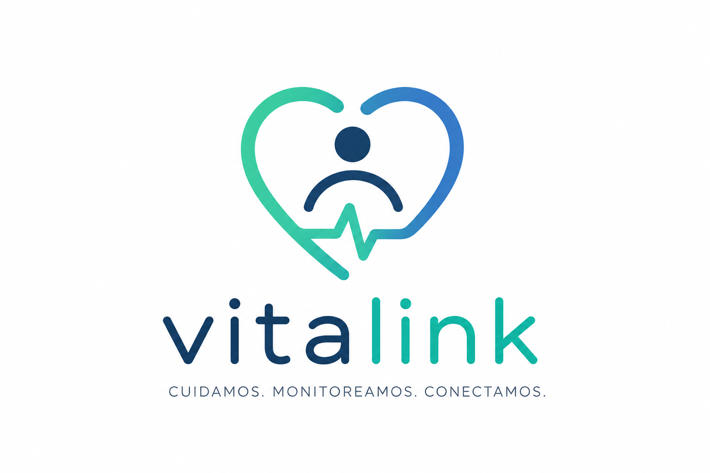
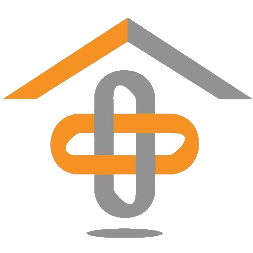
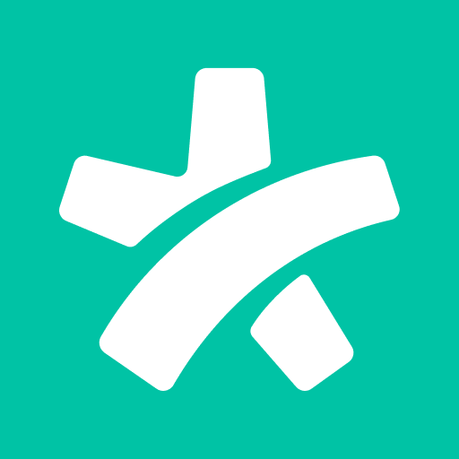

# Capítulo II: Requirements Elicitation & Analysis

## 2.1. Competidores

VitaLink se desarrolla dentro del mercado de soluciones digitales orientadas al monitoreo de salud, cuidado de adultos mayores y conexión entre pacientes, familiares y proveedores de servicios de salud. Debido a que la propuesta integra diferentes funcionalidades dentro de un mismo ecosistema, se identificaron competidores que cubren total o parcialmente las necesidades que VitaLink busca atender.

Para el análisis competitivo se seleccionaron **iDUAM, CarePredict y Doctoralia Perú**. Los dos primeros presentan una competencia más directa debido a sus soluciones de monitoreo remoto y asistencia para adultos mayores, mientras que Doctoralia representa una competencia indirecta relacionada principalmente con la búsqueda de profesionales, gestión de citas y atención médica a distancia.

### iDUAM / iDUAMTata

**iDUAM** es una plataforma de telemedicina y monitoreo biométrico desarrollada por NATURALPHONE S.A. Su propuesta integra dispositivos inteligentes con una plataforma digital para obtener información relacionada con frecuencia cardíaca, presión arterial, oxigenación, temperatura y electrocardiograma, además de ofrecer videollamadas médicas y mecanismos de asistencia ante emergencias.

Dentro de su ecosistema se encuentra **iDUAMTata**, una solución dirigida específicamente al adulto mayor. Esta incorpora monitoreo biométrico, detección de caídas, geolocalización, acompañamiento mediante asistentes virtuales y una red familiar que recibe alertas cuando se identifica una situación relevante.

### CarePredict

**CarePredict** es una plataforma especializada en el cuidado y monitoreo de adultos mayores. Su solución utiliza un dispositivo wearable denominado **Tempo**, capaz de recopilar información relacionada con movimiento, actividad, ubicación y patrones cotidianos del usuario.

La plataforma utiliza estos datos para identificar cambios en el comportamiento habitual del adulto mayor y generar alertas a familiares o responsables. También incorpora funcionalidades de detección de caídas, seguimiento de ubicación y alertas relacionadas con la seguridad.

CarePredict cuenta además con una propuesta para personas que envejecen en sus hogares mediante **CarePredict @Home**, permitiendo a los familiares recibir información y notificaciones relacionadas con cambios detectados en la actividad del adulto mayor.

### Doctoralia Perú

**Doctoralia Perú** es una plataforma digital que permite a los usuarios encontrar profesionales de salud, consultar su disponibilidad y solicitar citas presenciales o en línea. La plataforma conecta a pacientes con una amplia variedad de profesionales y especialidades médicas.

Doctoralia también ofrece servicios dirigidos a profesionales de salud mediante **Doctoralia Pro**, incluyendo agenda digital, recordatorios, videoconsultas, comunicación con pacientes y herramientas para la gestión de la atención.

Aunque Doctoralia no se encuentra orientada específicamente al monitoreo preventivo de adultos mayores, representa un competidor indirecto importante para VitaLink debido a su posicionamiento como intermediario digital entre pacientes y proveedores de servicios médicos.

### 2.1.1. Análisis competitivo

|Competitive Analysis Landscape|  |  |  |  |  |
|---|---|---|---|---|---|
| **¿Por qué llevar a cabo este análisis?** |  | Analizar a la competencia permitirá identificar cómo VitaLink puede diferenciarse de otras soluciones de monitoreo, cuidado de adultos mayores y acceso a servicios de salud, considerando las necesidades de las familias y proveedores de salud en el mercado peruano. |  |  |  |
| | | **VitaLink** | **iDUAM / iDUAMTata**  | **CarePredict**  | **Doctoralia Perú**  |
| **Perfil** | **Overview** | Plataforma orientada al monitoreo preventivo y acompañamiento de adultos mayores, conectando familiares y proveedores de salud. | Plataforma de telesalud que integra monitoreo biométrico, telemedicina y asistencia para adultos mayores. | Plataforma de monitoreo para adultos mayores mediante wearable y análisis de sus actividades diarias. | Plataforma que conecta pacientes con profesionales de salud y facilita la reserva de consultas. |
| **Perfil** | **Ventaja competitiva ¿Qué valor ofrece a los clientes?** | Integra monitoreo preventivo, participación familiar y conexión con proveedores de salud en un mismo ecosistema. | Combina monitoreo biométrico, telemedicina, funciones de emergencia y una red familiar. | Especialización en adultos mayores mediante monitoreo continuo y detección de cambios en sus actividades. | Amplia red de profesionales y facilidad para buscar, comparar y reservar servicios médicos. |
| **Perfil de Marketing** | **Mercado objetivo** | Adultos mayores y sus familias; clínicas, hospitales y profesionales de salud. | Adultos mayores, familias, pacientes que requieren monitoreo e instituciones de salud. | Adultos mayores, familiares, agencias de cuidado y organizaciones de senior living. | Pacientes, profesionales de salud y centros médicos. |
| **Perfil de Marketing** | **Estrategias de marketing** |  Promoción digital dirigida a familias y alianzas con proveedores de salud. | Promoción de su ecosistema de telesalud y alianzas con organizaciones públicas y privadas. | Casos de éxito y promoción de tecnología para mejorar el cuidado y seguridad de adultos mayores. | Posicionamiento digital, opiniones de pacientes y mayor visibilidad para los profesionales registrados. |
| **Perfil de Producto** | **Productos & Servicios** | Monitoreo de indicadores, alertas, historial del adulto mayor, red familiar y solicitudes de atención. | Monitoreo biométrico, telemedicina, SOS, geolocalización, historial y acompañamiento remoto. | Wearable Tempo, monitoreo de actividad, detección de caídas, ubicación y alertas. | Búsqueda de profesionales, citas, videoconsultas, agenda y gestión de pacientes. |
| **Perfil de Producto** | **Precios & Costos** |  Modelo de suscripción para familias y membresías o comisiones para proveedores de salud. | Suscripción mensual por planes, complementada con venta de dispositivos. También ofrece soluciones B2B y B2G. | Venta de hardware especializado complementada con una suscripción mensual al servicio. | Modelo freemium para profesionales, complementado con planes de suscripción de pago. |
| **Perfil de Producto** | **Canales de distribución (Web y/o Móvil)** | Web Application responsive y Landing Page. | Aplicación móvil, plataforma web y dispositivos inteligentes. | Aplicación móvil, plataforma web y wearable propio. | Plataforma web y aplicación móvil. |
| **Análisis SWOT** | **Fortalezas** |  Enfoque en adultos mayores, integración entre familia y proveedores y adaptación inicial al mercado peruano. | Ecosistema amplio de telesalud, monitoreo biométrico y funciones específicas para adultos mayores. | Alta especialización en monitoreo de adultos mayores y wearable propio. | Amplia presencia digital, red de profesionales y herramientas para pacientes y especialistas. |
| **Análisis SWOT** | **Debilidades** |  Marca nueva, sin una red consolidada de usuarios o proveedores y con IoT inicialmente simulado. | Dependencia de dispositivos asociados y mayor complejidad por la cantidad de funcionalidades ofrecidas. | Requiere hardware especializado y una suscripción para utilizar el servicio completo. | Su propuesta no está especializada en adultos mayores ni en monitoreo preventivo continuo. |
| **Análisis SWOT** | **Oportunidades** |  Crecimiento de la población adulta mayor y mayor interés por soluciones de salud y monitoreo remoto. | Expansión de servicios de telesalud y monitoreo domiciliario en Latinoamérica. | Mayor demanda de tecnologías que apoyen el cuidado independiente de adultos mayores. | Crecimiento de la adopción de reservas y consultas médicas digitales. |
| **Análisis SWOT** | **Amenazas** | Competidores internacionales consolidados y dificultad inicial para generar confianza y alianzas. |  Aparición de nuevas plataformas de telemedicina y dispositivos de monitoreo. | Wearables de consumo que incorporen funcionalidades similares de monitoreo. |  Otras plataformas de citas y soluciones propias desarrolladas por clínicas. |

### 2.1.2. Estrategias y tácticas frente a competidores

A partir del análisis competitivo realizado, VitaLink plantea estrategias preliminares orientadas a aprovechar las oportunidades identificadas, responder a las fortalezas de los competidores y diferenciarse dentro del mercado de soluciones digitales destinadas al cuidado y acompañamiento de adultos mayores.

#### Estrategia 1: Diferenciación mediante un ecosistema integrado de acompañamiento

VitaLink buscará diferenciarse evitando competir únicamente como una plataforma de monitoreo o como un sistema de reserva de citas. Su propuesta se centrará en conectar dentro de una misma experiencia al adulto mayor, sus familiares y los proveedores de servicios de salud.

Esta estrategia permite aprovechar las diferencias existentes entre competidores como Doctoralia, cuya propuesta se concentra principalmente en conectar pacientes con profesionales de salud, y plataformas como CarePredict e iDUAM, que poseen una mayor orientación hacia el monitoreo remoto.

**Tácticas:**

- Centralizar la información del adulto mayor, sus alertas y las solicitudes de atención.
- Permitir que familiares autorizados participen en el seguimiento del adulto mayor.
- Relacionar las alertas detectadas con acciones que permitan solicitar atención a proveedores registrados.
- Mantener al adulto mayor y su red de acompañamiento como elementos centrales de la experiencia.

#### Estrategia 2: Adaptación al mercado peruano y reducción de barreras de adopción

VitaLink buscará aprovechar su enfoque inicial en el mercado peruano para ofrecer una experiencia adaptada a las necesidades económicas, culturales y tecnológicas de sus segmentos objetivo.

Esta estrategia permitirá diferenciar la propuesta frente a soluciones internacionales que utilizan dispositivos propios, modelos de suscripción establecidos para otros mercados o experiencias que podrían no responder directamente a las características de los usuarios peruanos.

**Tácticas:**

- Validar mediante entrevistas cuánto estarían dispuestas a pagar las familias por el servicio.
- Diseñar diferentes planes de suscripción de acuerdo con las necesidades de los usuarios.
- Evitar que la plataforma dependa exclusivamente de un único dispositivo propietario.
- Diseñar una experiencia accesible y sencilla para adultos mayores y familiares con diferentes niveles de experiencia tecnológica.

#### Estrategia 3: Desarrollo de una red de proveedores orientada a la atención del adulto mayor

VitaLink buscará desarrollar inicialmente una red limitada pero especializada de proveedores de salud relacionados con las necesidades frecuentes de los adultos mayores, en lugar de competir directamente con plataformas consolidadas por cantidad de profesionales disponibles.

Esta estrategia permitirá fortalecer la conexión entre las funciones de monitoreo de VitaLink y la posibilidad de solicitar atención cuando el adulto mayor o sus familiares la requieran.

**Tácticas:**

- Establecer inicialmente alianzas con clínicas, centros médicos y profesionales relacionados con la atención de adultos mayores.
- Permitir que los proveedores reciban y gestionen solicitudes de atención mediante VitaLink.
- Brindar visibilidad dentro de la plataforma a los proveedores afiliados.
- Ampliar progresivamente la red de proveedores conforme aumente la cantidad de familias usuarias.

