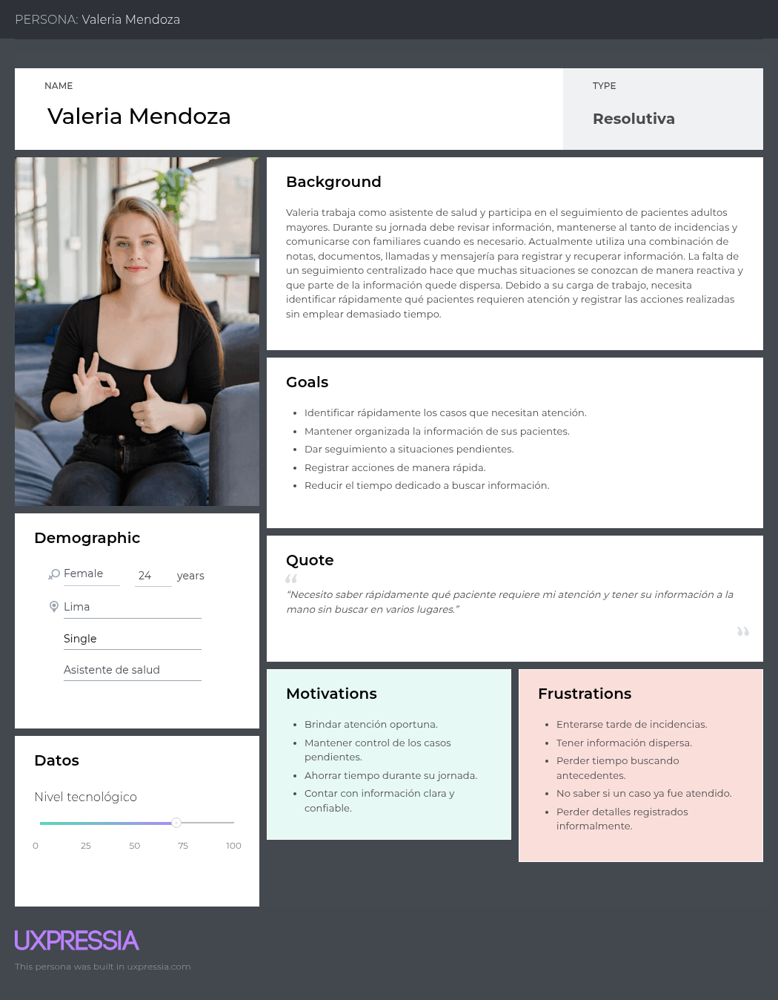
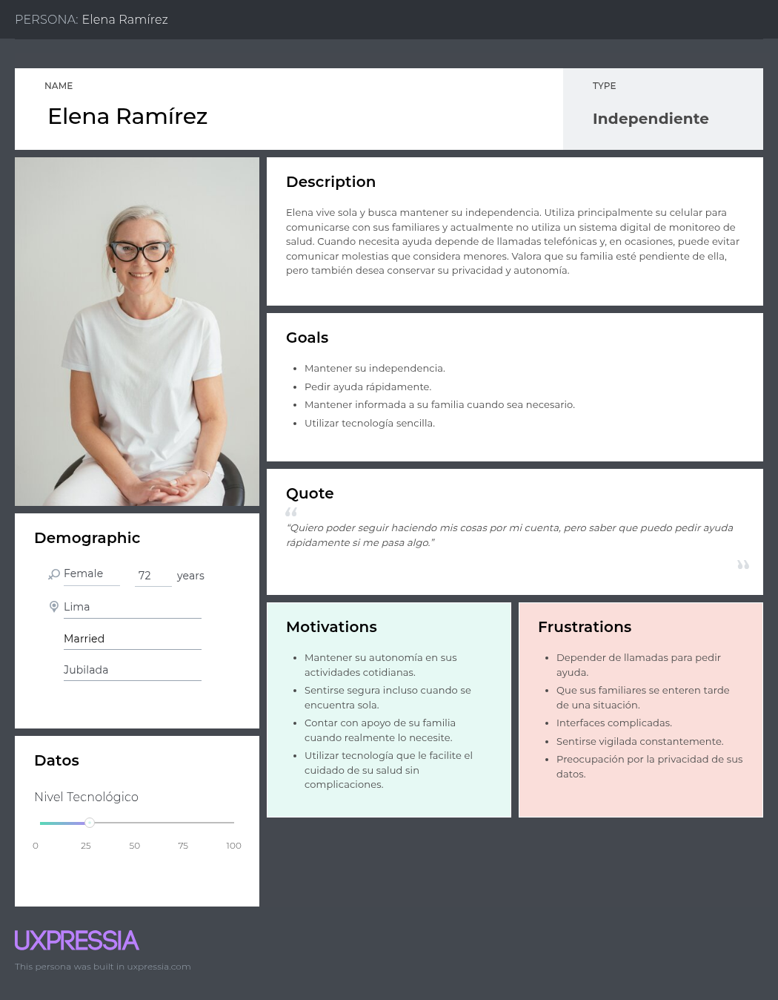
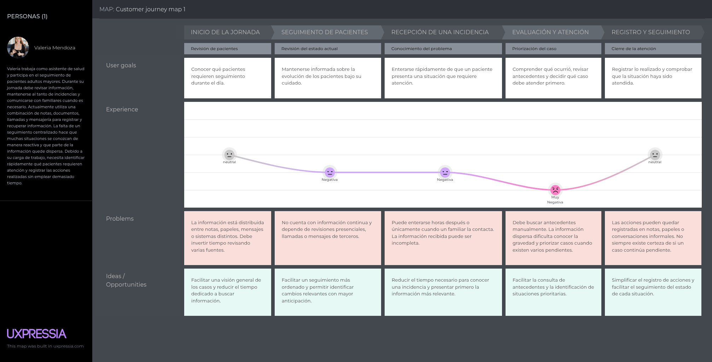
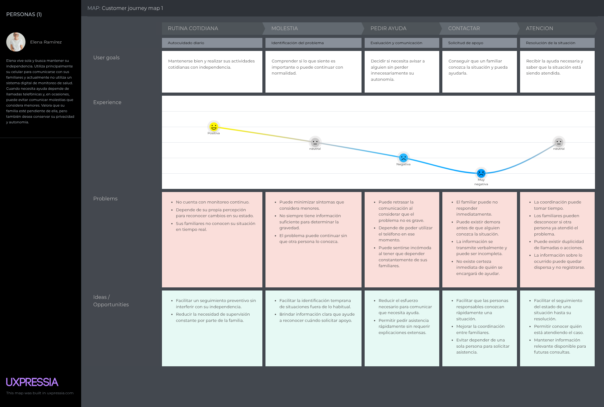
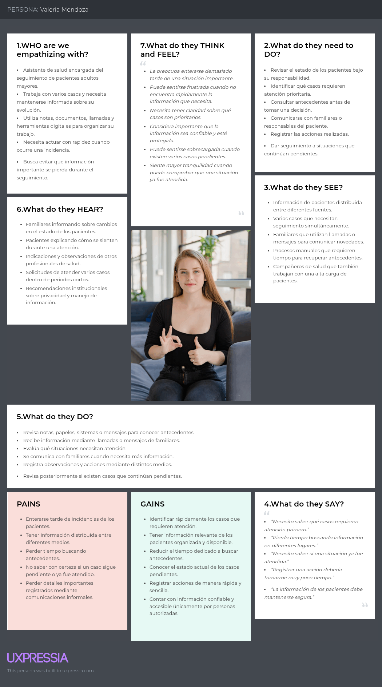
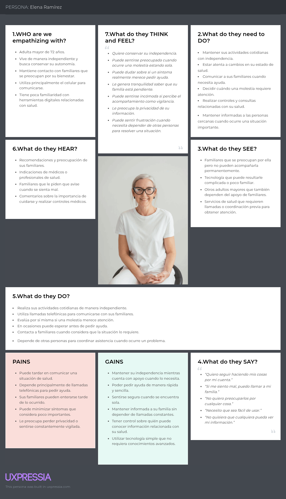

## 2.3. Needfinding

### 2.3.1. User Personas

User Persona del segmento 1:

User Persona del segmento 2:

### 2.3.2. User Task Matrix

| **Task** | **Elena Ramírez - Frecuencia** | **Elena Ramírez - Importancia** | **Valeria Mendoza - Frecuencia** | **Valeria Mendoza - Importancia** |
|---|---|---|---|---|
| Observar o revisar el estado de salud | Alta | Alta | Alta | Alta |
| Comunicar cambios o incidencias de salud | Media | Alta | Media | Alta |
| Evaluar si una situación requiere atención | Media | Alta | Alta | Alta |
| Solicitar o coordinar ayuda ante una situación de riesgo | Baja | Alta | Media | Alta |
| Consultar antecedentes o información de salud | Baja | Media | Alta | Alta |
| Mantener comunicación con familiares o responsables | Alta | Alta | Media | Alta |
| Registrar información relacionada con una situación de salud | No aplica | No aplica | Alta | Alta |
| Dar seguimiento a una situación pendiente | Baja | Alta | Alta | Alta |
| Confirmar si una situación ya fue atendida | Baja | Alta | Media | Alta |
| Asistir o participar en controles de salud | Media | Alta | Alta | Alta |
| Priorizar casos según su necesidad de atención | No aplica | No aplica | Alta | Alta |

### 2.3.3. User Journey Mapping

User Journey Mapping del segmento 1:

User Journey Mapping del segmento 2:

### 2.3.4. Empathy Mapping

Empathy Mapping del segmento 1:

Empathy Mapping del segmento 2:

