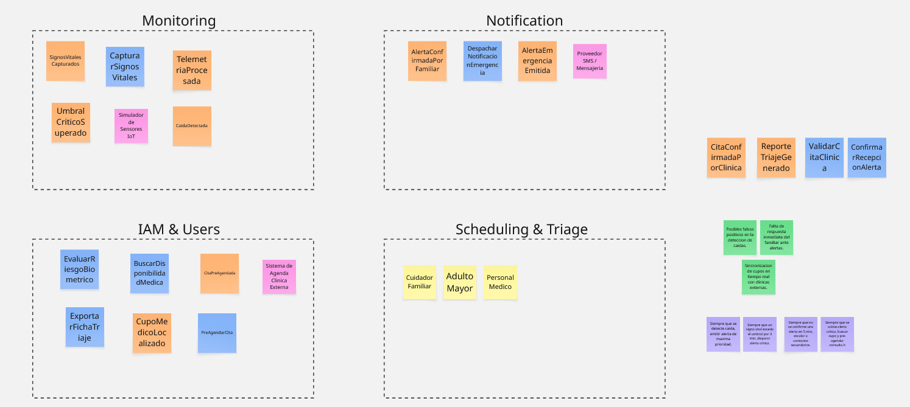

## 2.4. Big Picture Event Storming

#### Introduccion
En esta seccion se presenta el resultado de la sesion colaborativa de Big Picture Event Storming para VitaLink. Esta dinamica permitio al equipo modelar visualmente el flujo de negocio de telemonitoreo geriatrico de extremo a extremo, estructurando los eventos de dominio, los comandos de activacion, los actores clave, los sistemas externos y las politicas de respuesta ante emergencias medicas.

#### Resumen del Proceso Realizado
La sesion se desarrollo en Miro, organizando los elementos mediante una linea de tiempo interactiva estructurada en cuatro Bounded Contexts preliminares y zonas de soporte operacional:

1. **Monitoring Context:**
   * **Eventos de Dominio:** SignosVitalesCapturados, TelemetriaProcesada, UmbralCriticoSuperado, CaidaDetectada.
   * **Comando:** CapturarSignosVitales.
   * **Sistema Externo:** Simulador de Sensores IoT.
   * **Proposito:** Gestionar la ingesta continua de parametros fisiologicos y detectar anomalias biometricas en tiempo real.

2. **Notification Context:**
   * **Eventos de Dominio:** AlertaEmergenciaEmitida, AlertaConfirmadaPorFamiliar, ConfirmarRecepcionAlerta.
   * **Comando:** DespacharNotificacionEmergencia.
   * **Sistema Externo:** Proveedor SMS / Mensajeria (Twilio).
   * **Proposito:** Distribuir alertas criticas multicanal a la red de cuidadores de forma inmediata.

3. **Scheduling & Triage Context:**
   * **Eventos de Dominio:** CupoMedicoLocalizado, CitaPreAgendada, CitaConfirmadaPorClinica, ReporteTriajeGenerado.
   * **Comandos:** EvaluarRiesgoBiometrico, BuscarDisponibilidadMedica, PreAgendarCita, ValidarCitaClinica, ExportarFichaTriaje.
   * **Sistema Externo:** Sistema de Agenda Clinica Externa.
   * **Proposito:** Evaluar el nivel de riesgo clinico y pre-agendar consultas de urgencia en centros de salud aliados.

4. **IAM & Users Context:**
   * **Actores Principales:** Cuidador Familiar, Adulto Mayor y Personal Medico.
   * **Proposito:** Delimitar los roles, responsabilidades y niveles de acceso dentro del sistema.

5. **Politicas Reactivas y Hotspots:**
   * **Politicas (Lila):** Reglas automatizadas que disparan alertas maximas ante deteccion de caidas, escalan avisos si no hay confirmacion en 5 minutos y pre-agendan consultas ante anomalias sostenidas.
   * **Hotspots (Rojo/Verde):** Identificacion de riesgos criticos como falsos positivos en caidas, sincronizacion de agendas clinicas en tiempo real y tiempos de respuesta de los familiares.

#### Diagrama de Big Picture Event Storming

