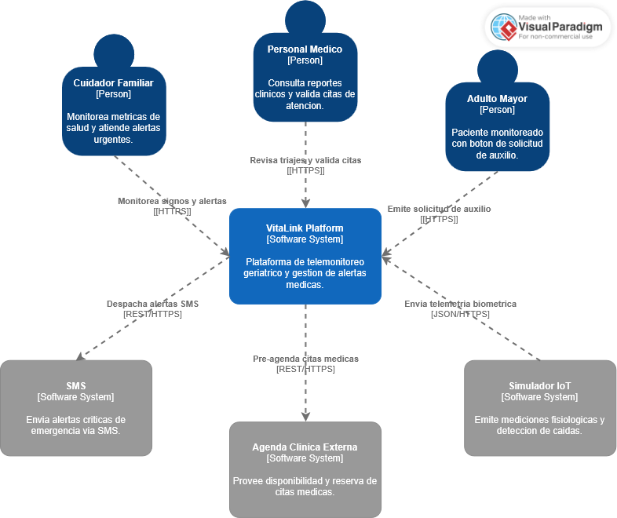
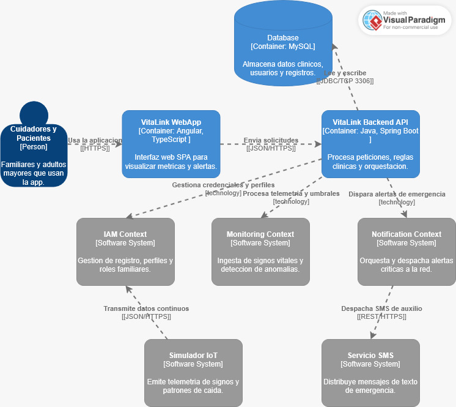
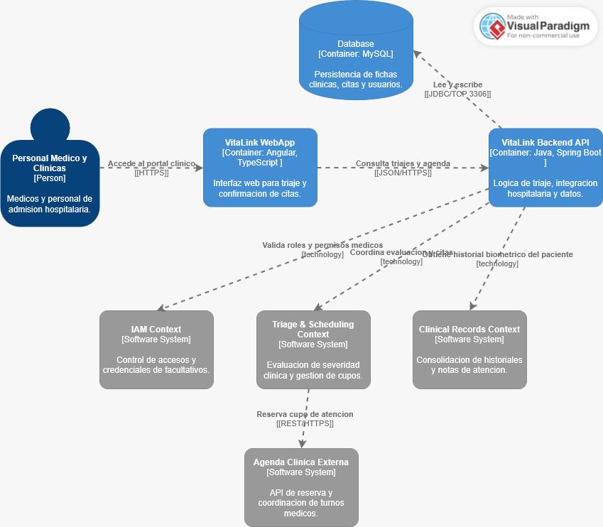
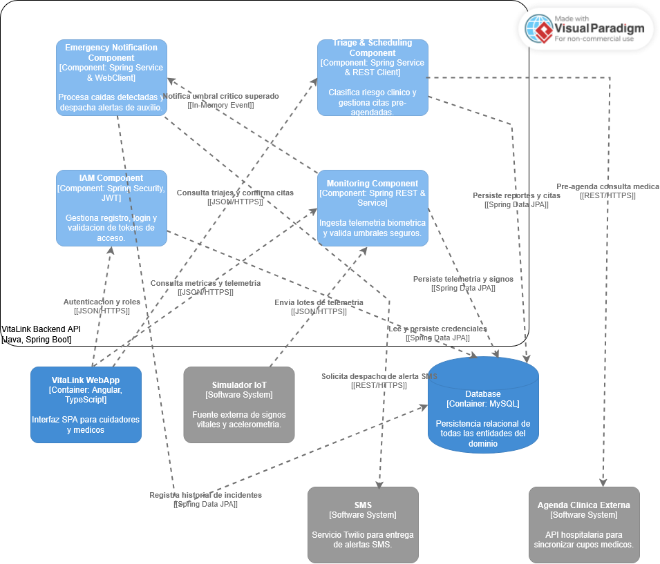

## 4.6. Domain-Driven Software Architecture

En esta seccion se formaliza la arquitectura de software de VitaLink bajo los principios de Domain-Driven Design (DDD) y el modelo C4. Se descompone la complejidad del dominio de telemonitoreo geriatrico en limites contextuales claros y se estructuran los niveles de abstraccion del sistema (Contexto, Contenedores y Componentes) para garantizar escalabilidad, mantenibilidad y alta disponibilidad ante incidentes criticos.

### 4.6.1. Design-Level Event Storming

A partir del Big Picture preliminar, se desarrollo la sesion de Design-Level Event Storming para refinar el modelo del dominio. Se definieron cuatro Bounded Contexts principales con sus respectivos comandos, eventos de dominio, agregados y modelos de lectura (queries):

#### 1. Monitoring Bounded Context
* **Proposito:** Administrar la telemetria fisiologica en tiempo real, evaluando lecturas frente a rangos clinicos predefinidos.
* **Aggregates:** `BiometricRecord`, `VitalSignsTracker`.
* **Commands:** `RecordVitalSigns`, `ProcessTelemetryStream`, `VerifyThresholds`.
* **Domain Events:** `VitalSignsRecorded`, `ThresholdExceeded`, `FallPatternDetected`.
* **Read Models (Queries):** `GetLatestVitalSignsQuery`, `GetBiometricHistoryQuery`.

#### 2. Emergency & Notification Bounded Context
* **Proposito:** Orquestar el despacho de alertas de emergencia y controlar el escalamiento multicanal hacia la red de apoyo familiar.
* **Aggregates:** `EmergencyAlert`, `NotificationChannel`.
* **Commands:** `TriggerEmergencyAlert`, `AcknowledgeAlert`, `EscalateNotification`.
* **Domain Events:** `EmergencyAlertTriggered`, `AlertAcknowledgedByCaregiver`, `AlertEscalated`.
* **Read Models (Queries):** `GetActiveAlertsQuery`, `GetAlertAuditTrailQuery`.

#### 3. Triage & Clinical Scheduling Bounded Context
* **Proposito:** Clasificar el nivel de gravedad clinica del paciente y pre-agendar de manera reactiva citas en la red de centros de salud aliados.
* **Aggregates:** `TriageAssessment`, `MedicalAppointmentReservation`.
* **Commands:** `EvaluateClinicalRisk`, `PreScheduleAppointment`, `ConfirmAppointment`.
* **Domain Events:** `RiskEvaluated`, `AppointmentPreScheduled`, `AppointmentConfirmed`.
* **Read Models (Queries):** `SearchAvailableMedicalSlotsQuery`, `ExportTriageSummaryQuery`.

#### 4. IAM & Profile Bounded Context
* **Proposito:** Gestionar la identidad, control de accesos, roles y vinculaciones familiares entre el paciente y sus tutores legales.
* **Aggregates:** `UserAccount`, `CaregiverAffiliation`.
* **Commands:** `RegisterUser`, `AuthenticateUser`, `LinkCaregiverToPatient`.
* **Domain Events:** `UserRegistered`, `UserAuthenticated`, `CaregiverLinked`.
* **Read Models (Queries):** `GetUserProfileQuery`, `GetAffiliatedPatientsQuery`.

### 4.6.2. Software Architecture Context Diagram

El diagrama de contexto representa el Nivel 1 del modelo C4 para VitaLink Platform. Este modelo delimita las fronteras del sistema, identificando a los usuarios que interactuan con la plataforma y los sistemas externos con los que se integra para el envio de alertas y coordinacion clinica.

#### 1. Elemento Central

* **VitaLink Platform [Software System]:** Plataforma de telemonitoreo geriatrico y gestion de alertas medicas. Procesa la telemetria biometrica en tiempo real, clasifica incidentes de riesgo fisiologico y orquesta la respuesta ante emergencias.

#### 2. Usuarios (Person)

* **Cuidador Familiar [Person]:** Monitorea metricas de salud y atiende alertas urgentes del adulto mayor a su cargo.
* **Personal Medico [Person]:** Consulta reportes clinicos y valida citas de atencion derivadas por el sistema de triaje.
* **Adulto Mayor [Person]:** Paciente monitoreado con boton de solicitud de auxilio rapido ante incidentes en el hogar.

#### 3. Sistemas Externos (External Software Systems)

* **SMS [Software System]:** Servicio externo de mensajeria que envia alertas criticas de emergencia via SMS hacia la red de apoyo familiar.
* **Agenda Clinica Externa [Software System]:** Sistema hospitalario que provee disponibilidad y reserva de citas medicas ambulatorias y de urgencia.
* **Simulador IoT [Software System]:** Entorno que emite mediciones fisiologicas continuas y deteccion de caidas hacia la plataforma.

#### 4. Relaciones y Protocolos de Comunicacion

* **Cuidador Familiar -> VitaLink Platform:** Monitorea signos y alertas mediante peticiones seguras utilizando el protocolo `HTTPS`.
* **Personal Medico -> VitaLink Platform:** Revisa triajes y valida citas medicas mediante `HTTPS`.
* **Adulto Mayor -> VitaLink Platform:** Emite solicitud de auxilio ante urgencias a traves de `HTTPS`.
* **Simulador IoT -> VitaLink Platform:** Envia telemetria biometrica empaquetada en formato estructurado mediante `JSON/HTTPS`.
* **VitaLink Platform -> SMS:** Despacha alertas SMS prioritarias mediante servicios web `REST/HTTPS`.
* **VitaLink Platform -> Agenda Clinica Externa:** Pre-agenda citas medicas conectandose via `REST/HTTPS`.

### 4.6.3. Software Architecture Container Diagrams

El diagrama de contenedores describe la arquitectura tecnica de alto nivel de VitaLink Platform, detallando las unidades de despliegue independientes, sus responsabilidades tecnicas, la persistencia relacional y su distribucion segun los Bounded Contexts identificados en el modelado del dominio.

Para mantener una representacion visual limpia y estructurada segun los roles del negocio, se especifican dos diagramas de contenedores: uno orientado al ecosistema familiar y de monitoreo del adulto mayor, y otro enfocado en los procesos de triaje y coordinacion clinica.

#### Container Diagram elaborado para Cuidadores y Adultos Mayores:

Este diagrama modela la interaccion de los cuidadores y adultos mayores a traves de la aplicacion web, canalizando las peticiones hacia la API central y distribuyendo la logica en los siguientes contenedores y modulos:

* **VitaLink WebApp [Container: Angular, TypeScript]:** Aplicacion SPA responsiva que renderiza el tablero de signos vitales, las notificaciones y los botones de solicitud de auxilio.
* **VitaLink Backend API [Container: Java, Spring Boot]:** Servidor de aplicaciones principal que expone servicios RESTful y orquesta los flujos de telemetria y seguridad.
* **Database [Container: MySQL]:** Base de datos relacional encargada del almacenamiento persistente de lecturas biometricas, perfiles e incidentes.
* **IAM Context [Software System]:** Modulo de dominio responsable del registro, autenticacion y asociacion entre tutores y pacientes.
* **Monitoring Context [Software System]:** Modulo central encargado de la ingesta de telemetria desde el Simulador IoT y la evaluacion de umbrales criticos.
* **Notification Context [Software System]:** Modulo que orquesta el despacho de alertas de emergencia y se conecta con el servicio externo de SMS.

#### Container Diagram elaborado para Personal Medico y Clinicas:

Este diagrama representa el flujo de trabajo del personal facultativo y de recepcion medica frente al sistema central de VitaLink:

* **Personal Medico y Clinicas [Person]:** Medicos geriatras y administrativos hospitalarios que revisan las derivaciones y confirman disponibilidad.
* **VitaLink WebApp [Container: Angular, TypeScript]:** Modulo web especializado en la visualizacion de listas de triaje y expedientes historicos.
* **VitaLink Backend API [Container: Java, Spring Boot]:** Punto de integracion transaccional que valida la atencion y procesa la logica de derivacion.
* **Triage & Scheduling Context [Software System]:** Modulo encargado de clasificar la severidad clinica segun parametros vitales y gestionar el pre-agendamiento asistido.
* **Clinical Records Context [Software System]:** Modulo de soporte que consolida las metricas historicas del paciente para el analisis medico.
* **Agenda Clinica Externa [Software System]:** Plataforma externa de los centros de salud asociados empleada para reservar turnos medicos oficiales.

### 4.6.4. Software Architecture Component Diagrams

El diagrama de componentes representa el Nivel 3 del modelo C4 para el contenedor central Backend API de VitaLink. En este nivel se expone la estructura interna de la aplicacion desarrollada en Spring Boot, delimitando los modulos logicos que procesan las reglas de negocio segun los Bounded Contexts y organizando el acceso a datos mediante Spring Data JPA.

#### 1. Componentes Internos del Backend API (Spring Boot)

* **IAM Component [Spring Security, JWT]:**
  * Responsable del registro seguro de cuidadores, medicos y pacientes.
  * Implementa filtros de autenticacion stateless mediante tokens JWT y autorizacion basada en roles para proteger los endpoints del sistema.

* **Monitoring Component [Spring REST & Service]:**
  * Provee controladores REST para la recepcion continua de telemetria biometrica (pulso, saturacion de oxigeno SpO2 y datos del acelerometro) remitida por el simulador IoT.
  * Evalua cada medicion entrante respecto a la linea base del adulto mayor para detectar anomalias fisiologicas.

* **Emergency Notification Component [Spring Service & WebClient]:**
  * Se activa de forma reactiva al registrar incidentes criticos como caidas confirmadas o descompensaciones severas.
  * Gestiona la cola de alertas y realiza peticiones HTTP asincronas hacia la API externa de SMS para notificar a la red familiar.

* **Triage & Scheduling Component [Spring Service & REST Client]:**
  * Ejecuta algoritmos de clasificacion de severidad clinica a partir de las anomalias detectadas.
  * Se integra con el sistema externo de agendas medicas para ubicar cupos disponibles y pre-agendar consultas ambulatorias o de urgencia.

#### 2. Elementos Externos y Persistencia

* **VitaLink WebApp [Container: Angular]:** Aplicacion cliente que consume los servicios expuestos por los componentes de seguridad, monitoreo y triaje.
* **Simulador IoT [Software System]:** Servicio emisor que transmite paquetes periodicos de telemetria hacia el controlador de monitoreo.
* **Database [Container: MySQL]:** Sistema gestor de base de datos relacional que almacena las tablas de usuarios, historiales biometricos, incidentes de caidas y pre-agendamientos.
* **SMS [Software System]:** Pasarela externa (Twilio) encargada del envio masivo e inmediato de mensajes de texto a dispositivos moviles.
* **Agenda Clinica Externa [Software System]:** Plataforma hospitalaria de terceros para la reserva y formalizacion de cupos medicos.

#### 3. Protocolos e Interacciones Tecnicas

* **VitaLink WebApp -> Componentes Internos:** Invocacion de endpoints REST protegidos mediante transferencias de payloads en formato `JSON/HTTPS`.
* **Simulador IoT -> Monitoring Component:** Ingestion masiva de telemetria empaquetada mediante peticiones POST `JSON/HTTPS`.
* **Monitoring Component -> Emergency Notification Component:** Comunicacion interna desacoplada mediante publicacion de eventos de aplicacion (`In-Memory Event`).
* **Emergency Notification Component -> SMS:** Invocacion de webhooks y servicios externos bajo protocolo `REST/HTTPS`.
* **Triage & Scheduling Component -> Agenda Clinica Externa:** Peticiones de consulta y bloqueo de cupos medicos mediante `REST/HTTPS`.
* **Componentes Internos -> Database:** Intercambio transaccional y persistencia de entidades mediante la capa ORM `Spring Data JPA / Hibernate` sobre conexion `JDBC (TC`.

